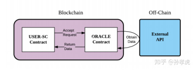

# 预言机

## 预言机/Oracle

区块链是一个确定性的、封闭的系统环境，目前区块链只能获取到链内的数据，而不能获取到链外真实世界的数据，区块链与现实世界是割裂的。区块链不允许不确定的事情或因素，智能合约不管何时何地运行都必须是一致的结果，所以虚拟机（VM）不能让智能合约有 network call（网络调用），不然结果就是不确定的。即智能合约不能进行输入/输出，无法主动获取外部数据的，所以只能通过预言机将数据给到智能合约。而预言机可以将外界信息写入到区块链内，完成区块链与现实世界的数据互通。它允许确定的智能合约对不确定的外部世界作出反应，是智能合约与外部进行数据交互的唯一途径，也是区块链与现实世界进行数据交互的接口。

## 预言机的应用场景有哪些？

预言机作为区块链与现实世界进行数据交互的桥梁，应用场景非常多，可以说一切需要与链下进行数据交互的 DApp 都需要预言机。比如金融衍生品交易平台、借贷平台、快递追踪/IoT、稳定币、博彩游戏、保险、预测市场等，目前最主要的场景就是 DeFi。